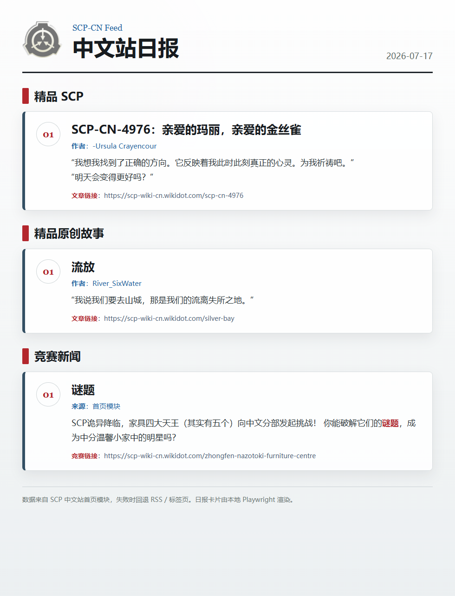

# SCP-CN Feed for AstrBot

> ⚠️ **本插件由 AI 生成，使用前请自行审查代码与运行效果，重要场景请先小范围测试。**

把 SCP 基金会中文分部首页的内容整理成机器人消息，支持：

- 精品原创 SCP
- 精品原创故事
- 当前竞赛/活动
- 一键生成 SCP-CN 日报
- 每天自动检查并推送新增内容
- 在配置页统一管理订阅会话
- 更新时可三选一推送整份日报、新增模块截图或纯文字

## 安装方法

把整个文件夹放进 AstrBot 的插件目录：

```text
AstrBot/data/plugins/astrbot_plugin_scp_cn_feed
```

目录结构应该像这样：

```text
astrbot_plugin_scp_cn_feed/
  main.py
  metadata.yaml
  requirements.txt
  README.md
  _conf_schema.json
  scp_cn_feed/
```

然后在 AstrBot WebUI 里重载/启用插件。

如果你是通过 AstrBot WebUI 上传插件包安装，请确保压缩包里最外层就是：

```text
astrbot_plugin_scp_cn_feed/
```

不要只上传里面的 `main.py`。

## 快速开始

安装成功后，在群聊或私聊里发送：

```text
/scp
```

机器人会返回帮助菜单。

立即生成一份日报：

```text
/scp 日报
```

订阅全部内容：

```text
/scp 订阅
```

查看当前会话订阅状态：

```text
/scp 状态
```

手动检查有没有新增：

```text
/scp 检查 全部
```

主动截图某个来源当前内容：

```text
/scp 截图 竞赛
```

取消全部订阅：

```text
/scp 取消订阅
```

## 常用命令

```text
/scp 帮助
/scp 来源
/scp 状态
/scp 日报
/scp 订阅
/scp 取消订阅
/scp 检查 <全部|精品scp|精品原创故事|竞赛>
/scp 截图 <精品scp|精品原创故事|竞赛>
/scp 基线 <全部|精品scp|精品原创故事|竞赛>
```

示例：

```text
/scp 订阅
/scp 检查 竞赛
/scp 截图 精品scp
```

## 配置方法

插件支持在 AstrBot WebUI 里管理订阅会话、更新推送形式、轮询间隔和会话黑白名单。

进入：

```text
AstrBot WebUI -> 插件管理 -> SCP-CN Feed -> 配置
```

可以看到配置项：

```json
{
  "poll_interval_days": 1,
  "subscription_sessions": [
    {
      "__template_key": "subscription",
      "origin": "aiocqhttp:GroupMessage:123456789",
      "featured_scp": true,
      "featured_tale": true,
      "contests": true
    }
  ],
  "whitelist_origins": [],
  "blacklist_origins": [],
  "update_push_mode": "module_screenshot"
}
```

含义：

- `poll_interval_days`：自动检查间隔
- 单位：天
- 默认值：1
- 最小值：1
- `subscription_sessions`：订阅会话列表，每项可分别开关精品 SCP、精品原创故事、竞赛与活动
- `whitelist_origins`：会话白名单，填写允许使用命令和接收推送的 `event.unified_msg_origin`
- `blacklist_origins`：会话黑名单，填写禁止使用命令和接收推送的 `event.unified_msg_origin`
- `update_push_mode`：更新推送形式，配置页中三选一：
  - `daily_report`：任一已订阅来源有新增时推送整份日报
  - `module_screenshot`：只推送发生新增的 SCP 中文站网页模块截图
  - `text`：只推送新增条目的文字信息

在聊天中执行 `/scp 订阅` 后，插件会默认订阅全部三个来源；执行 `/scp 取消订阅` 会取消全部来源。只有 `/scp 检查`、`/scp 截图`、`/scp 基线` 这类测试与排障指令保留来源参数。命令产生的结果会立刻写回 `subscription_sessions`，方便之后在配置页统一删改。直接在配置页修改订阅会话后，保存并重载插件即可同步到运行状态。

也就是说，默认每天检查一次。即使你填 `0`，插件也会按 `1` 天处理，避免高频访问 SCP 中文站。

黑白名单规则：

- `whitelist_origins` 留空时，不限制白名单。
- `whitelist_origins` 非空时，只有列表中的会话可以使用插件。
- `blacklist_origins` 优先级高于白名单；只要当前会话在黑名单中，就不能使用插件，也不会收到自动推送。
- 如果不确定当前会话标识，可以先在不配置白名单时发送 `/scp 状态`，或在被限制时查看插件返回的“当前会话标识”。

## 数据存储

订阅会话保存在插件配置的 `subscription_sessions` 中。每个会话/来源的最新内容锚点仍保存到 AstrBot 数据目录：

```text
data/plugin_data/astrbot_plugin_scp_cn_feed/state.json
```

这个位置符合 AstrBot 插件持久化数据规范，更新或重装插件时不容易被覆盖。

插件只在状态文件中保存每个会话、每个来源最后一次看到的最新内容 ID，用它判断后续新增；不会长期保存所有历史已读条目。删除订阅或状态文件加载时，会自动清理不再使用的旧锚点和旧版已读列表。

从 0.2.x 升级时，原 `state.json` 中的订阅会在首次启动 0.3.0 时自动迁移进 `subscription_sessions`，不会要求重新订阅。

如果旧版本已经在插件目录下生成过 `data/state.json`，插件启动时会在新位置不存在状态文件的情况下自动复制旧状态。

## 首次订阅会发生什么

第一次执行：

```text
/scp 订阅
```

插件会先抓取当前内容，并把每个来源当前最新的一条记录为当前会话的“已读基线”。

这样做是为了避免刚订阅时把历史内容全部刷屏。后续只有当前会话检测到新内容，才会自动推送。

如果你想为当前会话重新把当前内容标记为已读，可以发送：

```text
/scp 基线 全部
```

## 日报长什么样

发送：

```text
/scp 日报
```

默认图片模式会得到这样的日报：



关闭日报图片或图片渲染失败时，会自动回退为类似这样的文字消息：

```text
SCP-CN 日报 2026-05-04
数据源：首页模块，失败时回退 RSS/标签页

【精品 SCP】
1. SCP-CN-3236：以火书写 作者：Kcorena、Odeo、Re_spectators
   https://scp-wiki-cn.wikidot.com/scp-cn-3236
   “从此，火开始燃烧，火开始凝视。” “火开始以火书写名字。”

【精品原创故事】
1. 机器与永恒的四季 作者：mmmrrr
   https://scp-wiki-cn.wikidot.com/2000-season
   “孩子兴奋地跑向太阳，它第一次见到如此明亮的事物。直到筋疲力竭，它才发现紧握的手中不知何时空无一物。”

【竞赛与活动】
1. Destroy Department Contest Hub
   https://scp-wiki-cn.wikidot.com/destroy-department-contest-hub
   竞赛小作文摘要...
```

## 数据来源说明

插件优先读取 SCP 中文站首页：

```text
https://scp-wiki-cn.wikidot.com/
```

首页中会提取这些模块：

- 精品原创 SCP：首页 `精品原创SCP` 模块
- 精品原创故事：首页 `精品原创故事` 模块
- 竞赛与活动：首页 `summercontest` 竞赛横幅，以及它前面的小作文

如果首页模块暂时解析不到，会继续尝试：

1. Wikidot 官方 RSS feed
2. Wikidot 标签页

插件不会全站扫描，也不会进入每篇文章正文抓取。

## 注意事项

- 建议保持默认每天检查一次。
- 不建议把轮询间隔改得太短。
- SCP 中文站使用 Wikidot，偶尔会出现连接中断，插件会自动尝试备用来源。
- 成功抓取到的页面会缓存 1 小时；缓存期间重复触发日报或自动轮询会优先使用缓存，以降低站点不稳定造成的失败概率，但新增内容可能最多延迟 1 小时出现。手动 `/scp 检查` 会绕过缓存，直接请求最新内容。
- 竞赛部分不会输出图片链接，只输出链接和小作文摘要。
- 自动推送依赖当前会话的订阅记录，换群或换私聊需要重新订阅。
- 更新推送形式对自动轮询和 `/scp 检查` 同时生效；截图或日报图片渲染失败时会自动回退文字。
- 已读基线和新增判断按会话隔离；一个群或私聊执行订阅、基线、检查，不会影响其他会话的最新内容锚点。
- 会话黑白名单同样按 `event.unified_msg_origin` 判断；被禁用的会话不能使用命令，自动轮询也会跳过它们。
- 状态文件保存时会先写入临时文件，再原子替换正式文件，降低并发写入或异常退出导致 JSON 损坏的概率。

## 更新日志

### 0.4.0 - 2026-08-03

- 命令组由 `/scpfeed` 改为更简短的 `/scp`。
- `/scp 订阅` 移除来源参数，执行后默认订阅精品 SCP、精品原创故事和竞赛与活动三个来源。
- 取消命令改为 `/scp 取消订阅`，同样移除来源参数并默认取消全部来源。

### 0.3.0 - 2026-07-17

- 配置页新增订阅会话管理，聊天指令订阅会自动同步回配置。
- 更新推送新增整份日报、新增模块截图、纯文字三选一。
- 日报加入 SCP 基金会 Logo，作者等元信息改为蓝色，正文链接保留红色。
- 单个来源抓取失败不再中断其他来源推送。

### 0.2.0 - 2026-06-04

- `/scpfeed 日报` 改为使用本地 Playwright 渲染 HTML 图片卡片。
- 自动推送和手动检查新增内容时，支持截图 SCP 中文站真实网页区域。
- 新增 `/scpfeed 截图 <来源>`，可主动截取单个来源当前内容的网页区域。
- 精品 SCP / 精品原创故事的推送截图和主动截图消息会附带原文链接。
- 优化竞赛信息解析，竞赛名和正文中的链接文字会正确显示并高亮。
- 新增渲染相关配置，并在截图失败时自动回退为文本消息。
