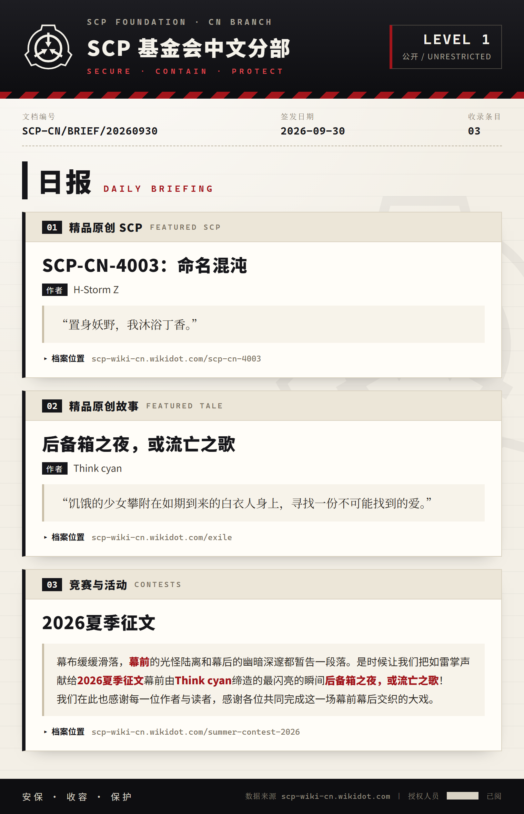
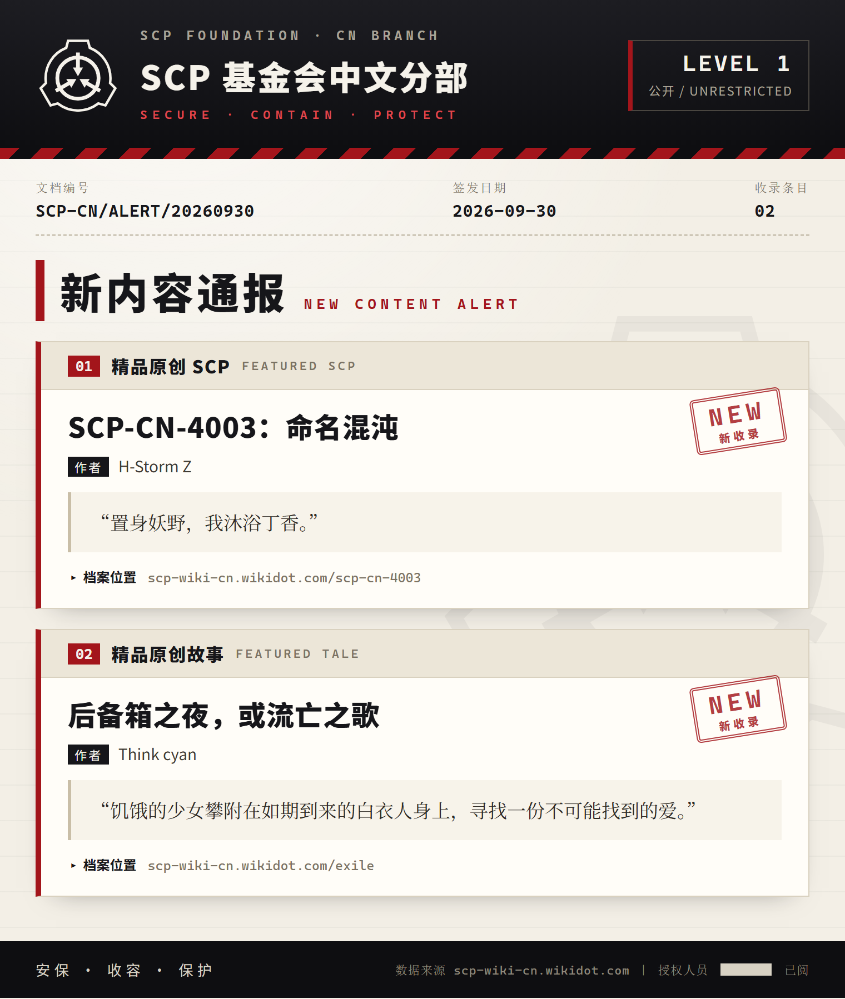

<div align="center">


# ☣️ SCP-CN Feed

**把 SCP 基金会中文分部首页的精品与竞赛，按时送进你的群聊。**

✨ [AstrBot](https://github.com/AstrBotDevs/AstrBot) · QQ 官方机器人 Markdown 按钮 · SCP 档案风日报卡片 ✨

[](LICENSE)
[](https://creativecommons.org/licenses/by-sa/3.0/deed.zh-hans)
[](https://www.python.org/)
[](https://github.com/AstrBotDevs/AstrBot)
[](https://github.com/yun474)


[功能亮点](#features) · [效果预览](#preview) · [安装使用](#usage) · [配置说明](#config) · [QQ 官方 Markdown](#markdown)

</div>

---

<a id="features"></a>

## ✨ 能做什么

- 读取中文分部首页，5 个区块随便勾：精品原创 SCP、精品原创故事、精品原创图书馆、主题精品、竞赛与活动。
- 日报和推送分开设置，各自选形式：SCP 档案风图片卡片、QQ 官方 Markdown + 按钮、纯文字。
- 首页换了新内容就推到订阅的群聊 / 私聊，QQ 官方机器人也能正常主动推送。

<a id="preview"></a>

## 🗂️ 效果预览

<table>
  <tr>
    <th>📰 日报</th>
    <th>🚨 新内容推送</th>
  </tr>
  <tr>
    <td valign="top"></td>
    <td valign="top"></td>
  </tr>
</table>

<a id="usage"></a>

## 🚀 安装与使用

在 AstrBot 插件管理里用仓库地址 `https://github.com/yun474/astrbot_plugin_scp_cn_feed` 安装，需要 AstrBot 4.16 或更新版本。

图片卡片用浏览器渲染，第一次用记得装一下 Chromium：

```bash
playwright install chromium
```

装不了的话，在配置里填个 Edge / Chrome 的路径也行；实在渲染不出来会自动改发文字。

| 指令 | 用途 |
| --- | --- |
| `/scp` / `/scp 日报` | 看首页当前的精品和竞赛 |
| `/scp 订阅` | 本会话接收新内容推送 |
| `/scp 退订` | 取消推送 |
| `/scp 状态` | 查看订阅状态、日报和推送设置、会话 ID |
| `/scp 帮助` | 显示指令列表 |

<a id="config"></a>

## ⚙️ 配置项说明

| 配置项 | 默认值 | 说明 |
| --- | --- | --- |
| `report_mode`（日报形式） | 图片卡片 | `/scp 日报` 用的形式；选 Markdown 时订阅、状态这些指令回复也会带按钮 |
| `report_sections`（日报展示区块） | 精品 SCP、精品故事、竞赛 | 日报里展示哪些区块，全部不勾等于全选 |
| `push_mode`（推送形式） | 图片卡片 | 有新内容时推送用的形式，选项同上 |
| `push_sections`（推送展示区块） | 精品 SCP、精品故事、竞赛 | 推送里展示哪些区块，全部不勾等于全选 |
| `subscribed_sessions`（订阅会话） | 空 | `/scp 订阅` 会自动写进来，也可以手动填会话 ID |
| `markdown_links`（Markdown 附带链接） | 开启 | 标题和摘要里的关键字段做成超链接，并加一个跳中文站首页的「SCP基金会」按钮 |
| `poll_interval_days`（检查间隔） | `1` 天 | 多久抓一次首页，最少 1 天 |
| `playwright_browser_path`（浏览器路径） | 留空 | 可选，渲染图片卡片用的 Chromium / Edge / Chrome |

- Markdown 只对 qq_official / qq_official_webhook 的群聊和单聊生效，其他平台自动改发图片卡片。
- 首页这几个区块一般一起更新：勾选的推送区块里只要有一个换了内容就推送一次，消息里列出全部勾选区块。

<a id="markdown"></a>

## 💬 QQ 官方 Markdown

把「日报形式」或「推送形式」选成 `QQ 官方 Markdown + 按钮` 即可，不用申请模板。点标题能跳原文，消息下面挂两行按钮：

```text
[               SCP基金会               ]  ← 跳转中文站首页
[🗞️ 日报] [🔔 订阅] [🔕 退订] [📡 状态]   ← 指令按钮
```

- 指令按钮在单聊里点一下直接发送；群聊里会把 `@机器人 /scp 日报` 填进输入框，再点发送就行。
- 如果日志里出现「Markdown 推送失败」并提到链接 / URL，把「Markdown 附带链接」关掉，链接会改成加粗，按钮只剩指令那一行。
- 用户在 QQ 里关了「允许主动消息」的话，推送会发不出去。

## 💛 致谢

内容来自 [SCP 基金会中文分部](https://scp-wiki-cn.wikidot.com/)，插件 logo 与卡片里的徽标遵循 [CC BY-SA 3.0](https://creativecommons.org/licenses/by-sa/3.0/deed.zh-hans)；项目代码遵循 [MIT 许可证](LICENSE)。

---

<div align="center">

喜欢的话，给云云点一颗 ⭐ 吧！

[更新日志](CHANGELOG.md) · [反馈问题](https://github.com/yun474/astrbot_plugin_scp_cn_feed/issues) · [MIT License](LICENSE) · [CC BY-SA 3.0](https://creativecommons.org/licenses/by-sa/3.0/deed.zh-hans)

**插件问题反馈 QQ 群：947667614**

</div>
